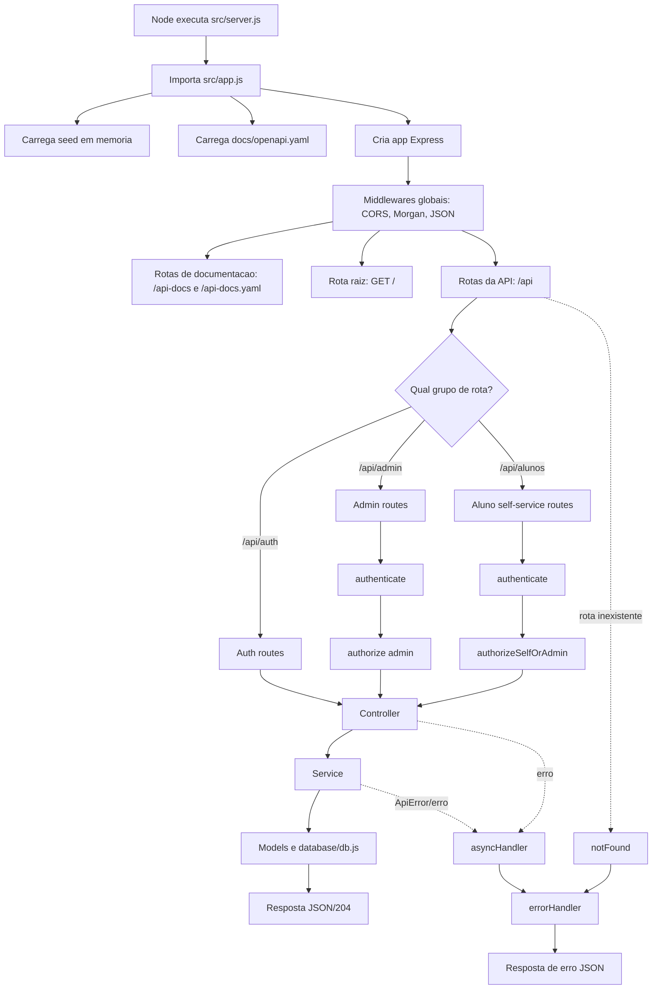
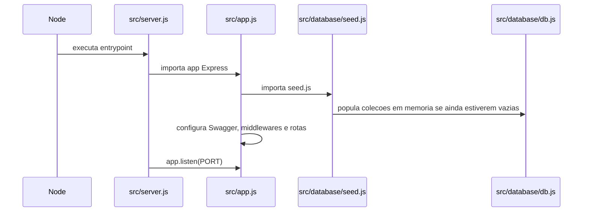
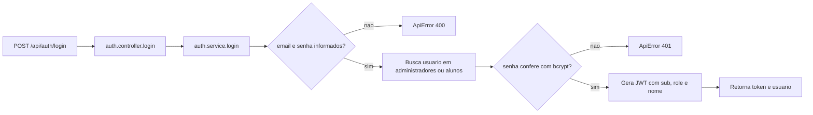
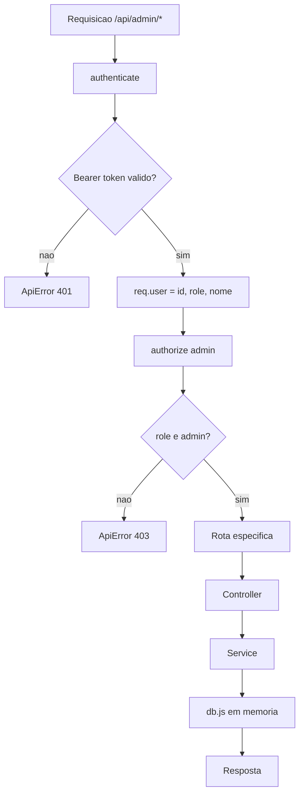
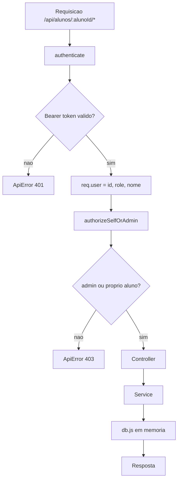
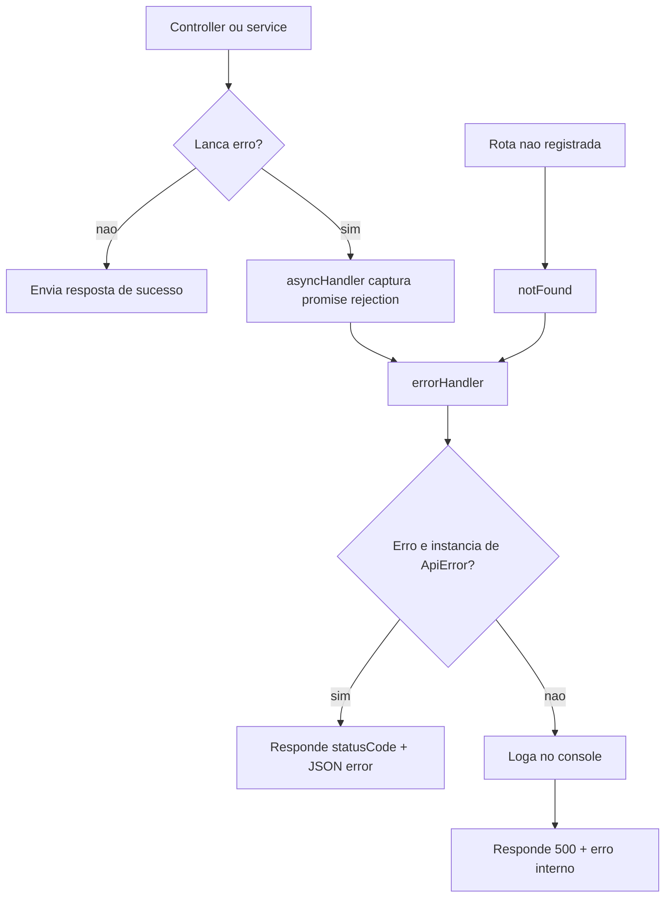
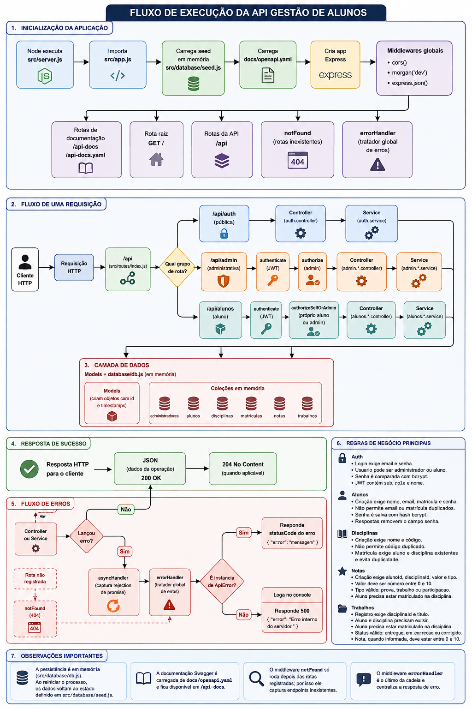

# Fluxo de execucao da API Gestao de Alunos

Este documento descreve como a API em `src` e executada, desde a inicializacao do servidor ate a resposta HTTP enviada ao cliente.

## Visao geral



## Infografico por camadas

```text
Cliente HTTP
  |
  v
src/server.js
  - Define a porta com process.env.PORT ou 3000.
  - Sobe o servidor com app.listen().
  |
  v
src/app.js
  - Importa o seed inicial da base em memoria.
  - Le docs/openapi.yaml para expor Swagger.
  - Cria o Express app.
  - Aplica middlewares globais:
      cors()
      morgan('dev')
      express.json()
  - Registra:
      /api-docs
      /api-docs.yaml
      /
      /api
      notFound
      errorHandler
  |
  v
src/routes/index.js
  - /api/auth   -> rotas publicas de autenticacao
  - /api/admin  -> rotas administrativas
  - /api/alunos -> autoatendimento do aluno
  |
  v
Controllers
  - Extraem params, query e body da requisicao.
  - Chamam a regra de negocio nos services.
  - Definem status HTTP e resposta.
  |
  v
Services
  - Validam campos obrigatorios e regras de negocio.
  - Conferem existencia de aluno, disciplina, nota e trabalho.
  - Lancam ApiError para erros esperados.
  - Chamam models e database/db.js.
  |
  v
Models + database/db.js
  - Models criam objetos padronizados com id e timestamps.
  - db.js guarda dados em memoria nas colecoes:
      administradores, alunos, disciplinas, matriculas, notas, trabalhos
  |
  v
Resposta HTTP
  - Sucesso: JSON ou 204 sem corpo.
  - Erro esperado: { "error": "mensagem" } com status do ApiError.
  - Erro inesperado: 500 com { "error": "Erro interno do servidor." }.
```

## Fluxo de inicializacao



## Fluxo das rotas

### Autenticacao publica



### Rotas administrativas

Todas as rotas abaixo passam primeiro por `authenticate` e depois por `authorize('admin')`.

```text
/api/admin/alunos
  GET /          -> listar alunos
  POST /         -> criar aluno
  GET /:id       -> buscar aluno
  PUT /:id       -> atualizar aluno
  DELETE /:id    -> remover aluno

/api/admin/disciplinas
  GET /              -> listar disciplinas
  POST /             -> criar disciplina
  GET /:id           -> buscar disciplina
  PUT /:id           -> atualizar disciplina
  DELETE /:id        -> remover disciplina
  POST /:id/matriculas -> matricular aluno na disciplina
  GET /:id/alunos    -> listar alunos matriculados

/api/admin/notas
  GET /          -> listar notas, com filtros opcionais alunoId e disciplinaId
  POST /         -> criar nota
  GET /:id       -> buscar nota
  PUT /:id       -> atualizar nota
  DELETE /:id    -> remover nota

/api/admin/trabalhos
  GET /          -> listar trabalhos, com filtros opcionais alunoId, disciplinaId e status
  GET /:id       -> buscar trabalho
  PUT /:id       -> corrigir trabalho
  DELETE /:id    -> remover trabalho
```

Fluxo administrativo:



### Rotas do aluno

Todas as rotas abaixo passam primeiro por `authenticate` e depois por `authorizeSelfOrAdmin`.

```text
/api/alunos/:alunoId/disciplinas
  GET -> lista disciplinas do proprio aluno ou de qualquer aluno quando o usuario e admin

/api/alunos/:alunoId/notas
  GET -> lista notas do proprio aluno ou de qualquer aluno quando o usuario e admin
         aceita filtro opcional disciplinaId

/api/alunos/:alunoId/trabalhos
  GET  -> lista trabalhos do aluno
  POST -> registra entrega de trabalho para o aluno
```

Fluxo do aluno:



## Regras de negocio principais

```text
Auth
  - Login exige email e senha.
  - Usuario pode ser administrador ou aluno.
  - Senha e comparada com bcrypt.
  - JWT contem sub, role e nome.

Alunos
  - Criacao exige nome, email, matricula e senha.
  - Nao permite email ou matricula duplicados.
  - Senha e salva com hash bcrypt.
  - Respostas removem o campo senha via sanitizeAluno.

Disciplinas
  - Criacao exige nome e codigo.
  - Nao permite codigo duplicado.
  - Matricula exige aluno existente, disciplina existente e evita duplicidade.

Notas
  - Criacao exige alunoId, disciplinaId, valor e tipo.
  - Valor deve ser numero entre 0 e 10.
  - Tipo valido: prova, trabalho ou participacao.
  - Aluno precisa estar matriculado na disciplina.

Trabalhos
  - Registro exige disciplinaId e titulo.
  - Aluno e disciplina precisam existir.
  - Aluno precisa estar matriculado na disciplina.
  - Status valido: entregue, em_correcao ou corrigido.
  - Nota, quando informada, deve estar entre 0 e 10.
```

## Tratamento de erros



## Observacoes importantes

- A persistencia e em memoria (`src/database/db.js`). Ao reiniciar o processo, os dados voltam ao estado definido em `src/database/seed.js`.
- A documentacao Swagger e carregada de `docs/openapi.yaml` e fica disponivel em `/api-docs`.
- O middleware `notFound` so roda depois das rotas registradas; por isso ele captura endpoints inexistentes.
- O middleware `errorHandler` e o ultimo da cadeia e centraliza a resposta de erro.


